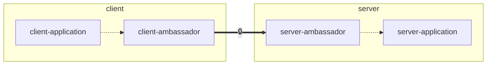
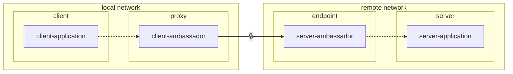

# Docker Ambassador with SSL capabilities

[Docker Ambassador](https://github.com/jnovack/ambassador) is a tiny Alpine-based ambassador container for tunnelling and optionally securing your client-server connections that are unable to otherwise communicate or secure.

## What is an 'ambassador container'?

An **ambassador container** is a type of sidecar container that acts as a proxy or intermediary between a main container
and one or more external services. It can simplify and secure access to other services by handling tasks like
authentication, encryption, and connection management so the main container doesn't need to worry about these details.

This project aims to implement only the authentication and encryption portion as those functions can be ubiquitous.
Features such as connection management and load balancing are not planned for this project.  This project is designed
to secure a single service or connection.

## Features

* alpine-based image
* socat for relaying traffic
* Uses supervisor for monitoring the socat processes

## Use

The ambassador containers can, but do not need to, run on the same machine as the applications.

### Example 1

In this example, the ambassador containers are running as a sidecar on the same machine as the client application and
server applications.



### Example 2

In this example, the ambassador containers are running as a service on separate machines from the client application and
server applications.



Run server service:

```sh
docker run --name mysql-server --network mynet -e MYSQL_ROOT_PASSWORD=pass -d mysql
```

Run server ambassador:

```sh
docker run -d --name server-ambassador --network mynet \
        -e MYSQL_SERVER_PORT_3306_TCP=tcp://mysql-server:3306 \
        -p 3306:3306 jnovack/ambassador
```

Run client ambassador:

```sh
docker run -d --name client-ambassador --network mynet --expose 3306 \
        -e MYSQL_PORT_3306_TCP=tcp://203.0.113.42:3306 jnovack/ambassador
```

Run client:

```sh
docker run -it --name mysql-client --network mynet \
        -e MYSQL_HOST=client-ambassador mysql bash
```

## Environment Variables

All environment variables are optional.

* `SSL` - One of `server` or `client`. Instantiates the container as the client or server container in terms of SSL termination.
* `SERVER_PRIVATE_KEY` - The server's concatenated private key and public certificate. Used on the server.
* `SERVER_PUBLIC_KEY` - The server's public certificate.  Used on the client for server verification.
* `CLIENT_PRIVATE_KEY` - The client's concatenated private key and public certificate. Used on the client.
* `CLIENT_PUBLIC_KEY` - The client's public certificate.  Used on the server for client authentication.

If you provide a `SERVER_PUBLIC_KEY` to the client, you will only be able to connect to the servers with certificates in `server.crt`.

If you do not provide `SERVER_PUBLIC_KEY` to the client, then the server will not be verified, but still encrypted.

If you provide `CLIENT_PUBLIC_KEY` to the server, only clients with certificates matching in `client.crt` will be permitted to connect. If you do not provide `CLIENT_PUBLIC_KEY` any client may connect.

You can `cat` multiple `client.crt`s together to allow for multiple clients.

## Enable SSL

OpenSSL has been added to the image so you can secure, and optionally authenticate the connection.

The container will automatically generate certificates if you do not pass any in through the environment when you add the `SSL` environment variable.

By default with SSL enabled, the connection is encrypted but it is not authenticated, not a big deal for your average tunnel session, but for enhanced security, it will print out the certificate so you can copy it to the other end.

> [!WARNING]
> It is trivial to execute a man-in-the-middle (MITM) attack unless you ensure you verify, at a minimum, the server certificate from the client.

For server verification, copy the server's `server.crt` to the client and provide `SERVER_PUBLIC_KEY` to the client ambassador.

For client authentication, copy the client's `client.crt` to the client and provide `CLIENT_PUBLIC_KEY` to the server ambassador.

Run server ambassador with SSL and client authentication:

```sh
docker run -d --name server-ambassador --network mynet \
       -e MYSQL_SERVER_PORT_3306_TCP=tcp://mysql-server:3306 \
       -e SSL="server" \
       -e SERVER_PRIVATE_KEY="$(cat server.pem)" \
       -e CLIENT_PUBLIC_KEY="$(cat client.crt)" \
       -p 3306:3306 jnovack/ambassador
```

Run client ambassador with SSL and server verification:

```sh
docker run -d --name client-ambassador --network mynet --expose 3306 \
       -e MYSQL_PORT_3306_TCP=tcp://203.0.113.42:3306 \
       -e SSL="client" \
       -e CLIENT_PRIVATE_KEY="$(cat client.pem)" \
       -e SERVER_PUBLIC_KEY="$(cat server.crt)" \
       jnovack/ambassador
```

## References

* [https://github.com/bandesz/docker-ambassador](https://github.com/bandesz/docker-ambassador)
* [https://github.com/md5/ctlc-docker-ambassador](https://github.com/md5/ctlc-docker-ambassador)
* [https://github.com/zbyte64/stowaway-ssl-ambassador](https://github.com/zbyte64/stowaway-ssl-ambassador)
